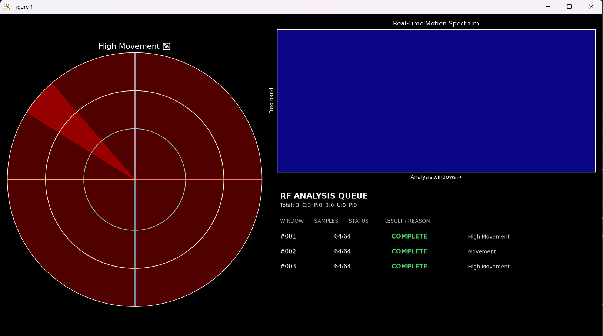
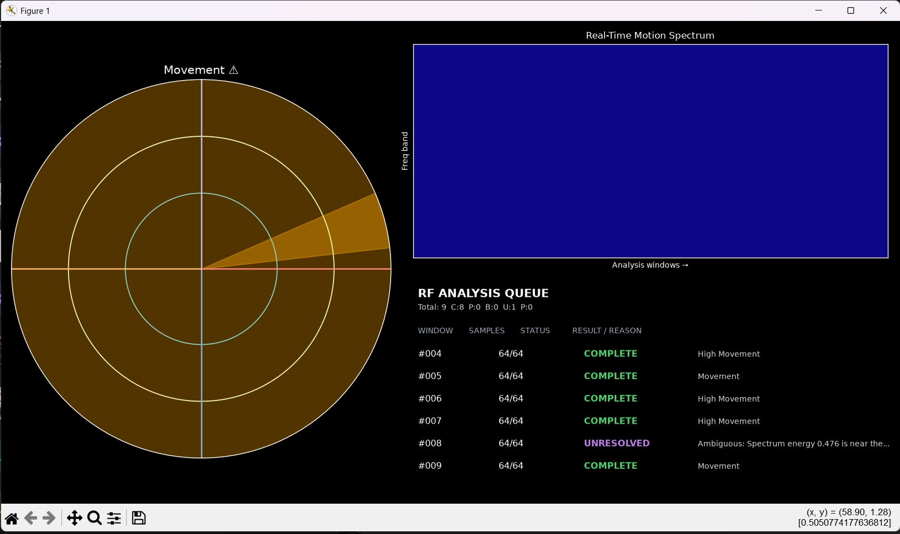
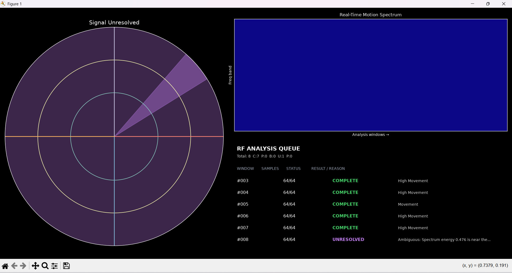

# RFSense AI

Passive WiFi-Based Human Presence and Motion Detection System.

RFSense AI uses an ESP32 to read WiFi RSSI values and sends them to a Python visualization over serial. NumPy FFT processing powers a radar-style movement display and real-time motion spectrum, without cameras or specialized radar hardware.

## Round 2 — Queue Discipline: Completion Signal

RFSense AI maintains an ordered FIFO queue of distinct, non-overlapping 64-sample RSSI analysis windows. Each window has a sequence ID and a visible completion outcome in the Matplotlib interface.

```text
ESP32 RSSI → serial acquisition → RSSI analysis window → FFT → movement classification
```

The queue wraps this existing MVP pipeline rather than replacing it. Each item is one of:

* **COMPLETE** — Full RSSI window processed successfully.
* **PARTIAL** — Analysis window ended before receiving all samples.
* **BLOCKED** — RSSI acquisition was unavailable.
* **UNRESOLVED** — Signal was processed but the result was ambiguous.

The queue panel shows sequence ID, sample count, state, result/reason, and status totals while preserving the original radar and spectrum views.

### Round 2 Evidence

Complete high-movement analysis window:



Complete movement analysis window:



Unresolved signal analysis window:



## Run

1. Set WiFi credentials in `arduino/esp32_rssi_sensor.ino`, upload it to the ESP32, and connect it over USB.
2. Install dependencies: `pip install -r requirements.txt`
3. Start real sensing: `python python/rf_visualizer.py`

The real mode processes only lines received from serial input. It never fabricates RSSI samples or injects artificial deltas.

### Isolated queue demonstration

Use the clearly separate demo mode to show all required queue states without hardware:

```bash
python python/rf_visualizer.py --demo
```

Use `--headless` for a non-GUI check of the demo queue.

## Stack

* ESP32 + WiFi hotspot
* Arduino IDE
* Python, NumPy, Matplotlib, PySerial

## Future scope

CSI, human presence estimation, occupancy detection, movement tracking, through-obstacle sensing research, and AI-powered activity classification.
